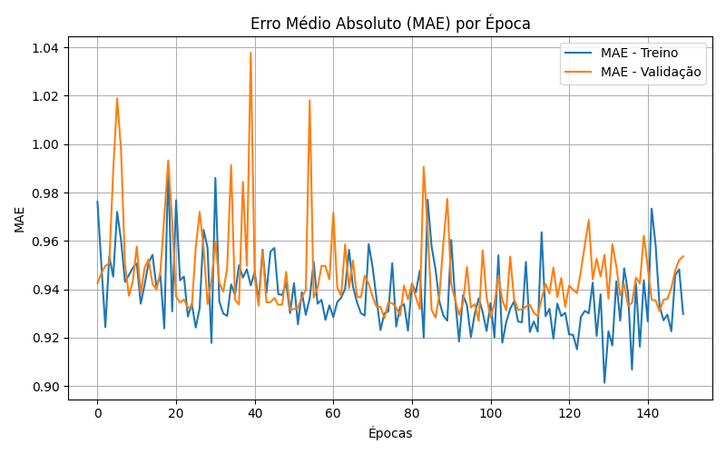
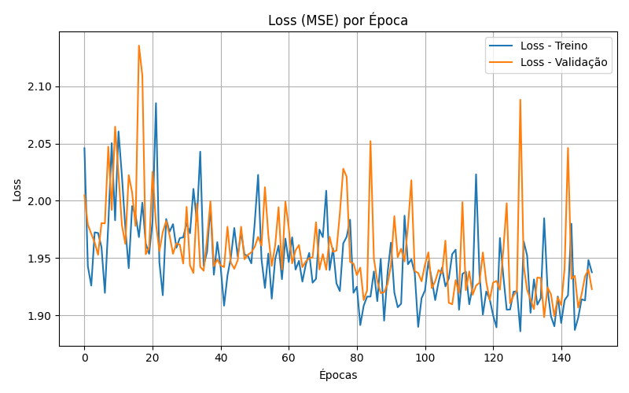

### README

# 🧠 Implementação da Rede Neural MLP para Previsão de Avaliações de Filmes

Este projeto utiliza Python e a biblioteca `TensorFlow` para treinar uma rede neural do tipo **MLP (Multilayer Perceptron)** que prevê a **avaliação média (`vote_average`)** de filmes com base em características extraídas do dataset `movies_metadata.csv`.

---

## 📊 Dados Utilizados

A rede utiliza as seguintes colunas como entrada:

- `popularity`: Popularidade do filme
- `runtime`: Duração do filme (em minutos)
- `revenue`: Receita gerada pelo filme
- `release_year`: Ano de lançamento do filme
- `original_language`: Língua original, codificada com one-hot encoding

A variável alvo é:
- `vote_average`: Nota média atribuída pelos usuários

---

## 🧹 Pré-processamento dos Dados

1. Conversão para tipos numéricos (`pd.to_numeric`)
2. Remoção de linhas com valores ausentes ou receita = 0
3. Extração do ano da data de lançamento
4. Codificação one-hot da coluna `original_language`
5. Normalização dos dados com `MinMaxScaler`
6. Divisão em treino (80%) e teste (20%)

---

## 🧠 Arquitetura da Rede Neural

A MLP é construída com `tensorflow.keras` e possui a seguinte estrutura:

```
Input:  X (com N features, incluindo dummies de linguagem)
↓
Dense(128, activation='relu', kernel_regularizer=l2(0.001))
↓
Dropout(0.3)
↓
Dense(64, activation='relu', kernel_regularizer=l2(0.001))
↓
Dense(32, activation='relu', kernel_regularizer=l2(0.001))
↓
Dense(16, activation='relu', kernel_regularizer=l2(0.001))
↓
Dense(1)  → Saída de regressão (nota prevista)
```

---

## ⚙️ Treinamento

- **Função de perda**: Mean Squared Error (MSE)
- **Otimizador**: Adam
- **Métrica monitorada**: Mean Absolute Error (MAE)
- **Épocas**: 150
- **Validação**: 20% dos dados de treino
- **Batch size**: 32

---

## 📈 Gráficos de Treinamento

### Erro Médio Absoluto (MAE) durante o treinamento:


> *Gráfico gerado com os dados de `model.fit()`*

### Perda (Loss - MSE) durante o treinamento:



> *Esses gráficos ajudam a visualizar a estabilidade do aprendizado e verificar se há overfitting.*

---

## 🎯 Exemplo de Predições

Aqui estão exemplos reais de predições feitas pela rede treinada:

| Filme                          | Nota Real | Nota Prevista |
|-------------------------------|-----------|---------------|
| Toy Story                     | 7.7       | 7.3           |
| Jumanji                       | 6.9       | 6.8           |
| Grumpier Old Men              | 6.5       | 6.1           |
| Father of the Bride Part II   | 5.7       | 5.5           |

> *As predições são razoavelmente próximas das avaliações reais, com um erro médio absoluto (MAE) em torno de **1.10***.

---

## 🚀 Como Executar o Projeto

Siga os passos abaixo para configurar e executar o projeto:

### 1. Clonar o repositório
```bash
git clone https://github.com/murilodsc/mlp.git
cd mlp
```

### 2. Criar e ativar um ambiente virtual
No macOS/Linux:
```bash
python3 -m venv venv
source venv/bin/activate
```

No Windows:
```bash
python -m venv venv
venv\Scripts\activate
```

### 3. Instalar as dependências
Com o ambiente virtual ativado, instale as dependências listadas no arquivo `requirements.txt`:
```bash
pip install -r requirements.txt
```

### 4. Executar o projeto
Após a instalação das dependências, execute o arquivo principal do projeto:
```bash
python main.py
```

### 5. Desativar o ambiente virtual
Após finalizar, você pode desativar o ambiente virtual com:
```bash
deactivate
```

### Observação
Certifique-se de ter o Python 3.7 ou superior instalado em sua máquina.
